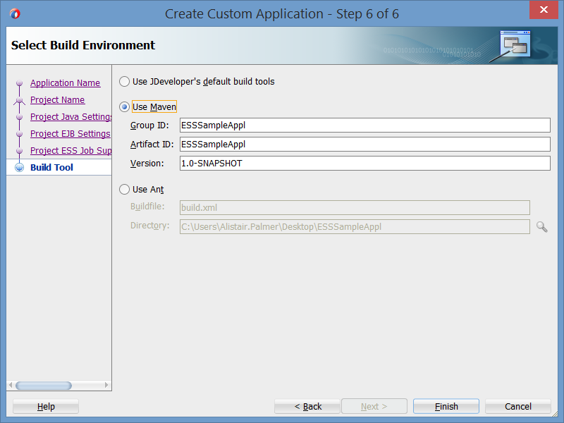
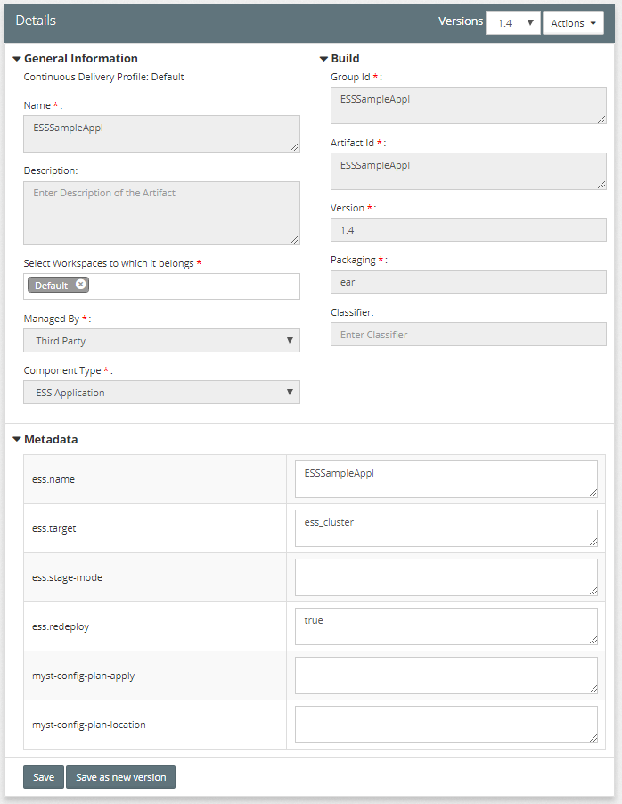

# Developing an ESS Application

The article at [SOA 12c–Creating ESS Job metadata (JDeveloper) | Siva's Blog](https://svgonugu.com/2015/05/24/soa-12ccreating-ess-job-metadata-jdeveloper/) provides a very good step by step guide on creating an ESS project in JDeveloper. Do however, make note of the following improvements.

## Picking a Build Tool

When you create the Custom Application, make sure to pick the Maven build tool. You can add in the respective Group ID, Artifact ID, and Version to suit your project's needs.



## XML Configuration Files

There are a number of XML configuration files that need to be updated. These are:

1. ejb-jar.xml
2. weblogic-ejb-jar.xml
3. weblogic-application.xml
4. adf-config.xml

The snippets below provide the files used in order to get a working ESS Application.

### ejb-jar.xml

**NOTE:** The message-driven EJB is mentioned in the updated ejb-jar.xml file. This is the same as the EJB name in the weblogic-ejb-jar.xml file.

```xml
<?xml version = '1.0' encoding = 'windows-1252'?>
<ejb-jar xmlns:xsi="http://www.w3.org/2001/XMLSchema-instance"
          xsi:schemaLocation="http://java.sun.com/xml/ns/javaee http://java.sun.com/xml/ns/javaee/ejb-jar_3_0.xsd"
          version="3.0" xmlns="http://java.sun.com/xml/ns/javaee">

  <enterprise-beans>
    <message-driven>
      <ejb-name>ESSAppEndpoint</ejb-name>
      <ejb-class>oracle.as.scheduler.ejb.EssAppEndpointBean</ejb-class>
    </message-driven>   

    <session> 
      <description>Runtime Session Bean</description> 
      <ejb-name>RuntimeServiceBean</ejb-name> 
      <ejb-class>oracle.as.scheduler.ejb.RuntimeServiceBean</ejb-class> 
    </session> 
    <session> 
      <description>Metadata Session Bean</description> 
      <ejb-name>MetadataServiceBean</ejb-name> 
      <ejb-class>oracle.as.scheduler.ejb.MetadataServiceBean</ejb-class> 
    </session> 
    <session> 
      <description>Async Request Bean</description> 
      <ejb-name>AsyncRequestBean</ejb-name> 
      <ejb-class>oracle.as.scheduler.ejb.AsyncRequestBean</ejb-class> 
    </session> 
  </enterprise-beans>

</ejb-jar>
```

### weblogic-ejb-jar.xml

**NOTE:** This also includes a role assignment. May not be required in all cases.

```xml
<?xml version = '1.0' encoding = 'windows-1252'?>
<weblogic-ejb-jar xmlns:xsi="http://www.w3.org/2001/XMLSchema-instance"
          xsi:schemaLocation="http://xmlns.oracle.com/weblogic/weblogic-ejb-jar http://xmlns.oracle.com/weblogic/weblogic-ejb-jar/1.5/weblogic-ejb-jar.xsd"
          xmlns="http://xmlns.oracle.com/weblogic/weblogic-ejb-jar">
  <weblogic-enterprise-bean>
    <ejb-name>ESSAppEndpoint</ejb-name>
    <message-driven-descriptor>
      <resource-adapter-jndi-name>ess/ra</resource-adapter-jndi-name>
    </message-driven-descriptor>
    <dispatch-policy>ESSRAWM</dispatch-policy>
  </weblogic-enterprise-bean>

  <run-as-role-assignment>
    <role-name>essSystemRole</role-name>
    <run-as-principal-name>weblogic</run-as-principal-name>
  </run-as-role-assignment>
</weblogic-ejb-jar>
```

### weblogic-application.xml

**NOTE:** Using the oracle.ess.client library reference is required to resolve the EJBs referred to in the ejb-jar.xml file. These are **not** present in the oracle.ess.thin.client

```xml
<?xml version = '1.0' encoding = 'windows-1252'?>
<weblogic-application xmlns:xsi="http://www.w3.org/2001/XMLSchema-instance"
                      xsi:schemaLocation="http://xmlns.oracle.com/weblogic/weblogic-application http://xmlns.oracle.com/weblogic/weblogic-application/1.6/weblogic-application.xsd"
                      xmlns="http://xmlns.oracle.com/weblogic/weblogic-application">
  <application-param>
    <param-name>jps.policystore.applicationid</param-name>
    <param-value>EssCustomDemo</param-value>
  </application-param>

  <listener> 
    <listener-class>oracle.mds.lcm.weblogic.WLLifecycleListener</listener-class> 
  </listener>

  <library-ref>  
    <library-name>oracle.ess.client</library-name> 
  </library-ref> 
</weblogic-application>
```

### adf-config.xml

```xml
<?xml version="1.0" encoding="windows-1252" ?>
<adf-config xmlns="http://xmlns.oracle.com/adf/config" xmlns:adf="http://xmlns.oracle.com/adf/config/properties"
            xmlns:sec="http://xmlns.oracle.com/adf/security/config">
  <adf:adf-properties-child xmlns="http://xmlns.oracle.com/adf/config/properties">
    <adf-property name="adfAppUID" value="ESSSampleAppl-6637"/>
  </adf:adf-properties-child>
  <sec:adf-security-child xmlns="http://xmlns.oracle.com/adf/security/config">
    <CredentialStoreContext credentialStoreClass="oracle.adf.share.security.providers.jps.CSFCredentialStore"
                            credentialStoreLocation="../../src/META-INF/jps-config.xml"/>
  </sec:adf-security-child>
  <adf-mds-config xmlns="http://xmlns.oracle.com/adf/mds/config"> 
    <mds-config version="11.1.1.000" xmlns="http://xmlns.oracle.com/mds/config"> 
      <persistence-config> 
        <metadata-namespaces> 
          <namespace path="/oracle/apps/ess/custom/osb" metadata-store-usage="ess_custom_metadata"/> 
        </metadata-namespaces> 
        <metadata-store-usages> 
          <metadata-store-usage id="ess_custom_metadata" deploy-target="true" default-cust-store="false"> 
            <metadata-store class-name="oracle.mds.persistence.stores.db.DBMetadataStore">
              <property name="jndi-datasource" value="jdbc/mds-ESS_MDS_DS"/> 
              <property name="repository-name" value="mds-ESS_MDS_DS"/> 
              <property name="partition-name" value="essUserMetadata"/> 
            </metadata-store> 
          </metadata-store-usage> 
        </metadata-store-usages> 
      </persistence-config> 
    </mds-config> 
  </adf-mds-config>
</adf-config>
```

# Building an ESS Application with Maven

**NOTE:** You will need JDeveloper installed on the build machine in order to complete this step as it uses ojdeploy and the deployment profiles that are created during development time.

By selecting the Maven build tool during application creation, you'll notice that ``pom.xml`` files are generated in the JDeveloper Application and JDeveloper Project directory. These get updated as you create the deployment profiles. In order to build the ESS Application, you can use the deployment profiles and reflect this in the Application level pom.xml to run the EAR deployment profile. The updated Application level ``pom.xml`` file should look similar to the example below.

## Application level pom.xml file

The ``pom.xml`` file includes the pom properties required if registering the artifact via CI Server to MyST Studio.

**Note:** The **ess.redeploy** artifact metadata property defaults to **true**. This is required as deployments will fail unless the old deployment is removed beforehand because the name would be in use.

The available properties are detailed in the next section under ESS Artifact Type.

```xml
<?xml version="1.0" encoding="UTF-8" ?>
<project xmlns="http://maven.apache.org/POM/4.0.0">
  <modelVersion>4.0.0</modelVersion>
  <groupId>ESSSampleAppl</groupId>
  <artifactId>ESSSampleAppl</artifactId>
  <version>1.0-SNAPSHOT</version>
  <packaging>pom</packaging>

  <properties>
    <ess.name>ESSSampleAppl</ess.name>
    <ess.target>ess_cluster</ess.target>
    <!--ess.redeploy>true</ess.redeploy-->    <!-- defaults to true -->
  </properties>

  <build>
    <resources>
      <resource>
        <directory>src/</directory>
        <includes>
          <include>**</include>
        </includes>
      </resource>
    </resources>
    <plugins>
      <plugin>
        <groupId>com.oracle.adf.plugin</groupId>
        <artifactId>ojdeploy</artifactId>
        <version>12.2.1-0-0</version>
        <configuration>
          <ojdeploy>${oracleHome}/jdeveloper/jdev/bin/ojdeploy</ojdeploy>
          <workspace>${basedir}/ESSSampleAppl.jws</workspace>
          <profile>EAR_SampleAppl</profile>
          <outputfile>${project.build.directory}/${project.build.finalName}.ear</outputfile>
        </configuration>
        <executions>
          <execution>
            <phase>package</phase>
            <goals>
              <goal>deploy</goal>
            </goals>
          </execution>
        </executions>
      </plugin>
    </plugins>
  </build>
</project>
```

## Maven Build Command

In order to build the ESS Application, use the standard maven command (in a MyST world this will include setting the version beforehand as well):

```bash
mvn clean package install:install deploy:deploy \
-DaltDeploymentRepository=central::default::http://maven-repository:8080/artifactory/libs-release \
-DoracleHome=${env.ORACLE_HOME}
```

**NOTE:** You do need to provide the ``oracleHome`` parameter as it is used to find the location of the ojdeploy executable. The command above assumes this is set as an environment variable ORACLE_HOME.

# Deployment

Whilst ESS is bundled as an EAR, you are unable to use the standard J2EE EAR deployment capabilities in MyST. This is due application requiring Metadata Repository configuration during deployment. The solution is to use the recently added feature in MyST called the **Deployment SDK**. This allows users to create new artifact types and specify how to deploy the artifact types by writing and including their own scripts.

## MyST Deployment SDK

The MyST Deployment SDK allows the user to programmatically define new artifact types and provide implementations for deployment.

The structure of the ESS Application artifact type is as follows. This structure can be found in the MyST Studio container.

`docker exec -ti myststudio_web bash`

```none
/usr/local/tomcat/conf/fusioncloud/ext/artifact-types
  |-- ess
      |-- metadata.json
      |-- wlst
          |-- deploy-essear.py
```

## ESS Artifact Type

The contents of the **metadata.json** file are:

```json
{
  "type": "ess",
  "label": "ESS Application",
  "deployment.type": "essear",
  "defaultPackaging": "ear",
  "metadata": [
    {
      "myst-cli-property-name": "name",
      "pom-keys": [
        "ess.name"
      ]
    },
     {
      "myst-cli-property-name": "target",
      "pom-keys": [
          "ess.target"
      ]
    },
     {
      "myst-cli-property-name": "stage-mode",
      "pom-keys": [
          "ess.stage-mode"
      ]
    },
     {
      "myst-cli-property-name": "redeploy",
      "pom-keys": [
          "ess.redeploy"
      ]
    },
     {
      "myst-cli-property-name": "myst-config-plan-apply",
      "pom-keys": [
          "myst-config-plan-apply"
      ]
    },
     {
      "myst-cli-property-name": "myst-config-plan-location",
      "pom-keys": [
          "myst-config-plan-location"
      ]
    }
  ],
  "implementation-source": "CLI",
  "introspection-rules": {
    "includes": {
      "resources": {
        "custom": {
          "by-property": ["myst-config-plan-location"]
        }
      }
    }
  }
}
```

## ESS Deployment Script

Deploying ESS is very similar as deploying an EAR application, with the added step of configuring the application for the metadata repository. If this configuration is not performed, you receive a *oracle.mds.config.MDSConfigurationException*. Some light reading of the *Oracle Support Document* *Doc ID 1350255.1* provides a sample WLST script that has been adapted to work with MyST and the ESS Artifact Type above.


The contents of the **deploy-essear.py** file are:

```python
execfile(System.getProperty("myst.home") + '/lib/targets/common/archive_utils.py')
execfile(System.getProperty("myst.home") + '/lib/targets/common/wlst_utils.py')
execfile(System.getProperty("myst.home") + '/lib/targets/deploy-application.py')
from java.io import File

def myst(conf):
  # Find location of the artifact
  artifact_id = conf.configuration.getFlagArguments()['artifact']
  application_location = getArtifactFile(conf, artifact_id)
  application_name = conf.getProperty('core.deployment[' + artifact_id + '].param[name]')
  application_target = conf.getProperty('core.deployment[' + artifact_id + '].param[target]')
  application_present = conf.getProperty('core.deployment[' + artifact_id + '].present')
  application_stageMode = conf.getProperty('core.deployment[' + artifact_id + '].param[stage-mode]')
  application_redeploy = conf.getProperty('core.deployment[' + artifact_id + '].param[redeploy]')
  
  if application_present is None:
    application_present = 'true'
  if application_redeploy is None:
    application_redeploy = 'true'
  if application_present.upper()=='TRUE':
    # check if a configuration plan needs to be applied before deployment
    application_configPlanApply=conf.getProperty('core.deployment[' + artifact_id + '].param[myst-config-plan-apply]')
    application_configPlanLocation=conf.getProperty('core.deployment[' + artifact_id + '].param[myst-config-plan-location]')
    application_location = apply_myst_config_plan(conf, application_location, application_configPlanApply, application_configPlanLocation)
  
  username, password, host = validate_args(conf)
  connect(username, password, host)
  
  # Apply MDS configuration
  archive = getMDSArchiveConfig(fromLocation=application_location);
  archive.setAppMetadataRepository(repository='mds-ESS_MDS_DSS',partition='essUserMetadata',type='DB',jndi='jdbc/mds-ESS_MDS_DS')
  archive.save();
  
  # Complete Deployment
  deploy_application(conf=conf, application_name=application_name, application_location=application_location, application_target=application_target, application_present=application_present, application_stageMode=application_stageMode, application_redeploy=application_redeploy)
```

## What it looks like in MyST?

The ESS Application has been built and uploaded to Artifactory with version 1.4. Manually registering the build in MyST (not via CI Server) will have the following information:



The ESS Application `pom.xml` file has the properties defined in order to get them to show similar to the screenshot above if built and published to MyST Studio via CI Server.


During deployment time we see the wlst **setAppMetadataRepository operation** being successfully applied before the deployment.

```
Operation "setAppMetadataRepository" successful.
 Saved metadata repository configurations in "/tmp/mystWorkspace/418a8f7f-be3a-4581-80c4-9f1384423f5c/target/artifacts/ESSSampleAppl/ESSSampleAppl-1.4.ear".
```

The entire log below:

```none
...

About to Deploy 1 Artifact
   ESSSampleAppl                                     essear         1.4

...

 Applying the MyST configuration plan to the application
 Trying to apply configuration plan '(EMBEDDED)/myst-config-plan.xml' to the source '/tmp/mystWorkspace/418a8f7f-be3a-4581-80c4-9f1384423f5c/tmp/06-27-18-02-27-04-26624/0c479cc2-f4a7-4a02-9df6-7e9101e4de16/ESSSampleAppl-1.4.ear'
 Parsing the plan contents
 MyST Configuration plan does not exist. Skipping applying customisation.
 No Custom MyST Configuration Plan found in: /tmp/mystWorkspace/418a8f7f-be3a-4581-80c4-9f1384423f5c/target/artifacts/ESSSampleAppl/ESSSampleAppl-1.4.ear
 Connecting to t3://SampleESS-1.rubiconred.aws:7001 with userid weblogic ...
 Successfully connected to Admin Server "AdminServer" that belongs to domain "SampleESS_domain".
 
 Warning: An insecure protocol was used to connect to the server. 
 To ensure on-the-wire security, the SSL port or Admin port should be used instead.
 
 Operation "setAppMetadataRepository" successful.
 Saved metadata repository configurations in "/tmp/mystWorkspace/418a8f7f-be3a-4581-80c4-9f1384423f5c/target/artifacts/ESSSampleAppl/ESSSampleAppl-1.4.ear".
 Finding MBean of type AppDeployment in all the instances ...
 /AppDeployments/ESSSampleAppl
 Stopping application ESSSampleAppl.
 .
 Completed the stop of Application with status completed
 Current Status of your Deployment:
 Deployment command type: stop
 Deployment State : completed
 Deployment Message : no message
 Undeploying application ESSSampleAppl ...
 .
 .
 Completed the undeployment of Application with status completed
 Current Status of your Deployment:
 Deployment command type: undeploy
 Deployment State : completed
 Deployment Message : no message
 Deploying application from /tmp/mystWorkspace/418a8f7f-be3a-4581-80c4-9f1384423f5c/target/artifacts/ESSSampleAppl/ESSSampleAppl-1.4.ear to targets ess_cluster (upload=true) ...
 .
 .
 Completed the deployment of Application with status completed
 Current Status of your Deployment:
 Deployment command type: deploy
 Deployment State : completed
 Deployment Message : no message

...
```

