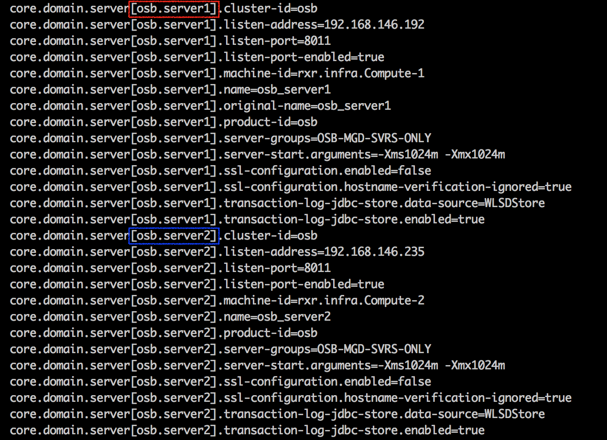
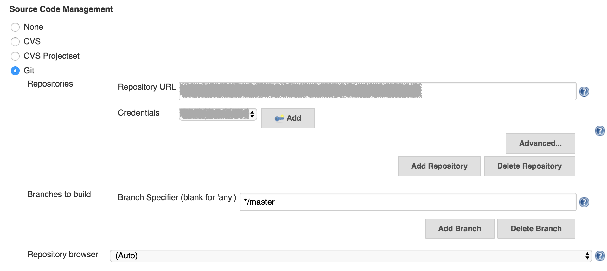
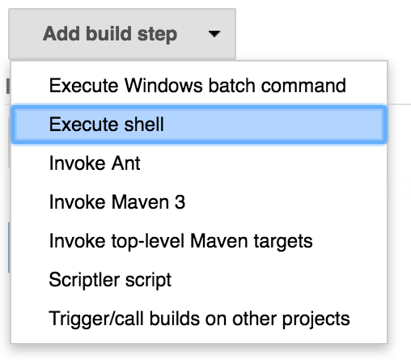

## {{page.title}}

Yes.

In this use case, we will do the following:

1. Redirect all traffic to node 1
2. Take node 2 out of the domain
3. Upgrade node 2 to OSB BP 5
4. Redirect all traffic to node 2
5. Verify working of upgraded node 2
6. Upgrade node 1 to OSB BP 5
7. Put node 1 and 2 back into the domain
8. Redirect traffic to both nodes

Example: Upgrading OSB to Bundle Patch 5 using a rolling restart approach

## One Time Configuration Steps {#HowdoIperformrollingrestartforpatcheswithMySTStudio?-OneTimeConfigurationSteps}

After establishing the MyST workspace integrated with MyST Studio using the steps detailed [here](/myst-management/myst-cli-with-myst-studio.md), execute the MyST properties action on the platform model of your choice by performing the following:

```
myst properties env.<env type>.<model name>.platform
```

Take note of the unique server logical IDs, you will use these later to specific the rolling in a sequence of your choice. In the example below, which is a 2 node OSB cluster, we have osb.server1 and osb.server2



Also, take note of the unique node logical IDs for each OSB node. These are defined as a comma-separated list under product.osb.node-list. In our example, lets assume the nodes are called node1 and node2.

### Create the Jenkins job to orchestrate the MyST patching with rolling restarts {#HowdoIperformrollingrestartforpatcheswithMySTStudio?-CreatetheJenkinsjobtoorchestratetheMySTpatchingwithrollingrestarts}

Jenkins is a CI server which allows for orchestrating multiple steps in a single job which can be executed on demand or as part of a schedule. The same principles would apply for setting up an orchestration in another CI server or dashboard such as Rundeck. In the example below it is assumed that MyST is installed under /opt/myst on the master \(or slave\) where the Jenkins job is being run under.

<!-- NOTE: I'm intentionally breaking the number list format because markdown can't retain numbering order across the complex blocks of text below : gokelly -->

1 . From the Jenkins console, click on "New Item"

2 . Create a "Freestyle project" 

3 . Select the SCM which you wish to pull the myst-workspace from. In our example, it is a Git repository


4 . Click on "Add build step" and select "Execute shell" 


> NOTE:  Alternatively, you can use the MyST CLI plugin for Jenkins. In order to provide instructions that would be compatible for other CI server and orchestration tools, we are going to use the generic "Execute shell" option in our example.

5 . Under "Execute shell", enter your desired patching sequence. An example matching the use case described at the start of this document is listed below. In this example, osb.server1 and osb.server2 are on node1 and osb.server3 and osb.server4 are on node2

```
cd myst-workspace
MYST_HOME=/opt/myst
PATH=$PATH:$MYST_HOME
MYST_WORKSPACE=/u01/app/oracle/admin/myst/jenkins/home/jobs/PROD.RollingRestart/workspace/myst-workspace
CONFIGURATION=env.ci.2_node.platform
 
# 1. Redirect all traffic to node 1
# TODO: Update the Load Balancer to redirect all traffic to node 1
  
# 2. Take node 2 out of the domain
myst stop-via-as $CONFIGURATION -Dservers=osb.server3,osb.server4
 
# 3. Upgrade node 2 to OSB BP 5
myst patch $CONFIGURATION -Dproduct.osb.node-list=node2
myst start-via-as $CONFIGURATION -Dservers=osb.server3,osb.server4
# If servers fail to start in the previous step due to an issue with the upgrade it will
#  automatically cause this job to abort. In this case, a revert of the patch(es) and
#  restart of node 2 can be performed by a separate patch revert job in Jenkins (or MyST Studio).
 
# 4. Redirect all traffic to node 2
# TODO: Update the Load Balancer to redirect all traffic to node 2
 
# 5. Verify the upgraded node 2 instance is working as expected
# If desired, you can add automated tests to run at this point
 
# 6. Upgrade node 1 to OSB BP 5
myst patch $CONFIGURATION -Dproduct.osb.node-list=node1
 
# 7. Put node 1 back into the domain
myst stop-via-as $CONFIGURATION -Dservers=osb.server1,osb.server2
myst start-via-as $CONFIGURATION -Dservers=osb.server1,osb.server2
 
# 8. Redirect traffic to both nodes
# TODO: Update the Load Balancer to redirect all traffic in it's original state (between node 1 and 2)
```

Placeholders have been left in the script above for automated tests and interaction with the load balancer for redirects. If the load balancer interactions are intended to be manual, you may wish to split the above up into multiple CI jobs which are triggered at the appropriate times after each manual load balancer configuration step. This same approach could also be done with MyST Studio alone and no CI server required as detailed in the section "Alternative Approach: Applying the patch and rolling restart exclusively with MyST Studio"  

6 . Save the job


## Orchestrating a fully-automated patch rolling restart from Jenkins using MyST {#HowdoIperformrollingrestartforpatcheswithMySTStudio?-Orchestratingafully-automatedpatchrollingrestartfromJenkinsusingMyST}

This part is simple, just go to the job in Jenkins and click the run button when you want to perform the fully-automated patch rolling restart.

## Alternative Approach: Applying the patch and rolling restart directly with MyST Studio as individual steps {#HowdoIperformrollingrestartforpatcheswithMySTStudio?-AlternativeApproach:ApplyingthepatchandrollingrestartdirectlywithMySTStudioasindividualsteps}

If you need to perform manual steps during the process such as redirecting the load balancer or running manually sanity checks, the Jenkins approach would not be ideal. In this case, you can simply perform the operations directly from MyST Studio as required as part of the overall manual sequence. 

For example, you could run the "Update" operation to apply the patch using the out-of-the-box feature in MyST Studio. Then when it comes to restarting certain nodes, you could use the "Control" operation to run the actions such as stop-via-as and start-via-as with the given overrides.


