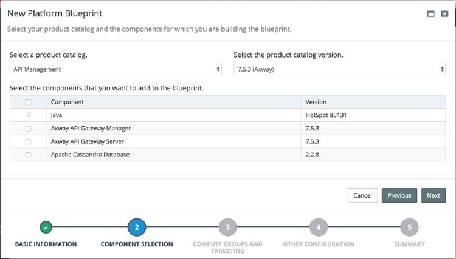
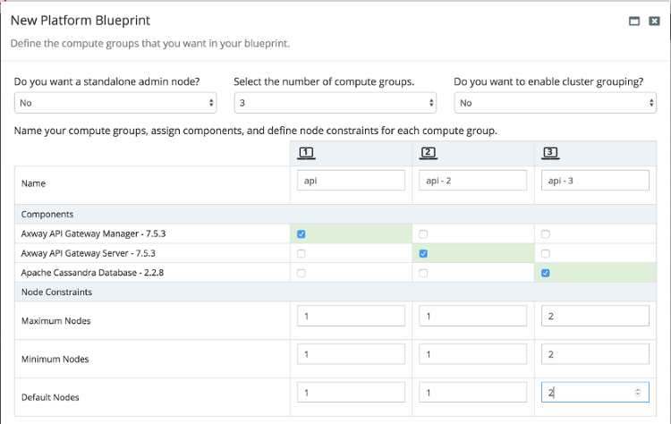

# Axway Product Catalog

Axway support is provided by the following three products, all defined within the  API Management product catalog

| Component | Description |
| --------- | ----------- |
| Apache Cassandra Database | Choosing this option will support the creation of Cassandra database instances, including multiple node clusters. Apache Cassandra support has been implemented to support API Gateway environments, however it is also possible to create standalone Cassandra DB environments. |
| Axway API Gateway Manager | Single administrative gateway instance in an API Manager configuration. |
| Axway API Gateway Server | A single API Gateway instance. This product is required when using the API Gateway Manager product, and is also used to define core configuration properties for the API Gateway product as a whole. |

# Assumptions

The implementation of Axway support assumes the use of certificate configuration.
All properties required by products within MyST Studio must be specified explicitly. It is not currently possible to establish a cassandra database without all certificate/keystore parameters defined and the related items pre-existing on the hosts.

# Creating an Axway Environment

A single MyST blueprint and model can be used to create an Axway API Gateway environment including an API Manager node, multiple API Gateway nodes, and a Cassandra database cluster. For each product being used, a single compute group should be defined to control the targeting of specific products.

Note that the compute node targeted for Cassandra DB use has 2 nodes in the above image to support a 2 node cluster.

Required product configuration parameters are detailed below. Once a model has been fully configured for all required products, performing a Provision within MyST Studio will deliver everything required to create an environment across all nodes through automation.

## Product Configuration Parameters

This section provides an example configuration for each supported product, listing all required properties for configuration.

### Axway API Gateway Server

| Name	| Example Value	| Explanation |
| ----- | --------------| --------- |
| `group`	| `Internal` |	Group API Gateway Server is configured as a member of |
| `license-path` | `/home/oracle/Axway.lic` |	Full path to license file on each node configured for API Gateway. This property is also used by API Gateway Manager. |
| `os-group` | `oinstall` |	OS group to use when creating product installation |
| `os-user` | `oracle` |	OS user to use when creating product installation |
| `python-path` | `/usr/local/bin/python2.7` |	Full path to Python 2.7 (or above) binary on each node configured for API Gateway. This property is also used by API Gateway Manager, and in a model containing both API Gateway Server and Cassandra DB, can be used by Cassandra DB.  |
| `service-pack-file` | `	APIGateway_7.5.3_SP6_Core_linux-x86-64_BN2018032339.tar.gz` |	Name of Axway API Gateway service pack file to install as part of patching product installation. This file will be found under the directory indicated by the install.dir MyST global variable. |

### Axway API Gateway Manager

| Name	| Example Value	| Explanation |
| ----- | --------------| --------- |
| `admin-host` | `192.168.146.222` | IP address/host API Manager is configured on |
| `admin-password` | `welcome1` | Password used to authenticate for administration functions |
| `admin-port` | `8090` | Port used for administration traffic |
| `group` | `Internal` | Group API Manager is configured as a member of |
| `groups` | `Internal,External` | Comma-separated list of all defined groups in API Manager instance |
| `management-address` | `192.186.146.222` | IP address/host used for management traffic |
| `os-group` | `oinstall` | OS group to use when creating product installation |
| `os-user` | `oracle` | OS user to use when creating product installation |
| `site-port` | `8095` | Port to use for gateway traffic |

### Apache Cassandra Database

Given the length of values for Cassandra Database parameters, explanations are not provided in the table below.

| Name	| Example Value	|
| ----- | --------------|
| `cluster-addresses` | 192.168.146.150,192.168.146.171 |
| `cqlrshrc-cert-file` | `/u01/share/dev.pem` |
| `cqlrshrc-key-file` | `/u01/share/dev.key` |
| `datacenter-name` | `GatewayDatacenter` (default value) |
| `listen-port` | `9042` (default value) |
| `python-path` | `/usr/local/bin/python2.7` |
| `rack-name` | `GatewayRack` (default value)  |
| `replication-factor` | `2` |
| `require-client-auth` | `true` (default value) |
| `ssl-algorithm` | `SunX509`  (default value) |
| `ssl-cipher-suites` | `TLS_RAS_WITH_AES_128_CBC_SHA,TLS_RSA_WITH_AES_256_CBC_SHA...`  (default value) |
| `ssl-enabled` | `true`  (default value) |
| `ssl-internode-encryption` | `all`  (default value) |
| `ssl-keystore-file` | `/u01/share/dev.jks` |
| `ssl-protocol` | `TLS`  (default value) |
| `ssl-store-type` | `JKS`  (default value) |
| `ssl-truststore-file` | `/u01/share/truststore.jks` |
| `ssl-truststore-password` | `welcome1` |
| `user` | `oracle` |

# Axway Support Roadmap

The next MyST release will provide support for the following:

## Axway advanced configuration

- Admin Gateway post-provisioning certificate configuration
- API Gateway 100 continue configuration
- API Gateway updating trace configuration
- API Gateway updating external connection settings, environment settings, certificate configuration, sign response policy, and primary store configuration.
- API Manager additional configuration support

## Axway Lifecycle management

- Support for start, stop, restart and destroy via the standard lifecycle management functions from MyST Studio.

## Property computation

A number of properties related to Cassandra configuration and the Admin API Gateway currently require manual configuration, but could have intelligent default values set by MyST model computation. This model computation is being implemented currently.

## Removal of redundant cluster configuration for Cassandra

Currently when configuring a Cassandra cluster a number of actions are performed on the second node of a cluster that repeat configuration already performed on the first node of a cluster. These redundant actions will be removed in future Cassandra DB support.

## Switch to optional certificate configuration

The current mandatory certificate configuration performed for an API Gateway environment will become optional in future API Gateway support, allowing for a larger range of usage scenarios.
