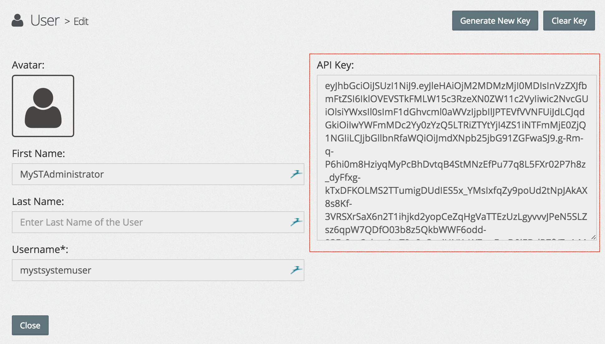
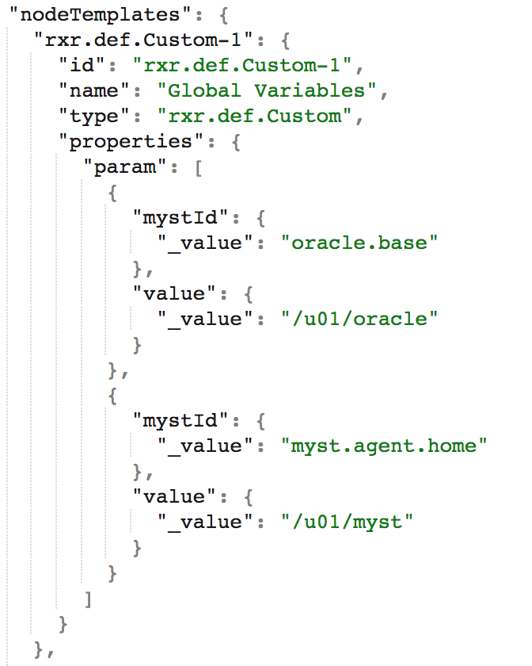

> **WARNING:** This is an advanced instruction for manipulating MyST using the REST APIs. You should not do this unless absolutely necessary and should take a backup of the database before performing any direct manipulations using the API. You have been warned.

If you are looking to set common properties against a Platform Blueprint this guide will show you how. Adding the commands into a parameterized script would allow you to bulk edit the properties and Platform Blueprints.

In this example, we are showing how to update a Platform Blueprint using the REST API. At a minimum you will require `curl` to be installed on your machine. To make JSON manipulation easier, it is also recommended to install `jq` which is downloadable from [here](https://stedolan.github.io/jq/download/).

## Retrieving your API key

In order to interact with API, you will first need to retrieve and/or regenerate an API key from MyST Studio. This can be performed as follows:  
1. Login to MyST Studio with an administrator account  
2. Click on "Administration" then select "Users"  
3. Under the MySTAdministrator \(API User\) click on drop-down and select "Show API Key"  
  
4. Copy the key, we will use this later in our MyST workspace. If you want, you can generate a new key at any time.  


## Setting up your environment

The below `curl` examples will assume the following are set as environment variables

* `MYST_TOKEN=<your api key>`
* `MYST_HOST=<your MyST host>`
* `BLUEPRINT_ID=<your blueprint id>`
* `BLUEPRINT_VERSION=<your blueprint version>`

**NOTE:** The `BLUEPRINT_ID` and `BLUEPRINT_VERSION` can easily be found in your browser URL when selecting the Platform Blueprint.

## Getting a list of available Blueprints

See a related article [How do I use the MyST REST API to see and manipulate Blueprint and Model source files?](/platform-configuration/rest-api.md)  to get a list of blueprints and their IDs using the REST API.

## Download the source file for a given Platform Blueprint

We are going to download that source to a file called `blueprint.json` for our Platform Blueprint.

```
curl -k -X GET -H "Authorization: Bearer $MYST_TOKEN"  "https://$MYST_HOST/api/v1/platform/blueprints/$BLUEPRINT_ID/versions/$BLUEPRINT_VERSION?suppressComputed=true&dataFilters=*" > blueprint.json
```

If you wish to retrieve a specific revision of a platform blueprint version, you can add %5B**pr23**%5D to the url as shown below. This will retrieve revision 23.

**Note:** when accessing a specific revision of  a platform blueprint version, the curl url needs to use `http` with the appropriate port instead of using `https`

```
curl -X GET -H "Authorization: Bearer $MYST_TOKEN"  "http://$MYST_HOST:8085/api/v1/platform/blueprints/$BLUEPRINT_ID/versions/$BLUEPRINT_VERSION%5Bpr23%5D?suppressComputed=true&dataFilters=*" > blueprint.json
```

## Manipulate the local Platform Blueprint source file and update MyST

#### Manually extract data element
If you want to change the previously downloaded Blueprint you need to first extract the contents from the `data` element and create a new file called `new-blueprint.json`.

For example,

```
{
  "data": {
    {
       "id": "c2a9a9c6-4dd6-44b4-8b7a-54a14a235802",
       "name": "SOA Blueprint",
       ...
```

should look like

```
{
    "id": "c2a9a9c6-4dd6-44b4-8b7a-54a14a235802",
    "name": "SOA Blueprint",
   ...
```

#### Using jq to extract data element
Alternatively, run the following in `jq` to create a `new-blueprint.json` file from `blueprint.json`

```
jq .data < blueprint.json > new-blueprint.json
```

#### Manually update the request payload
Now that you have a `new-blueprint.json` which is in a format that can be pushed to MyST, you can update the contents as you see fit.

Edit the new.json as desired - e.g. change `oracle.base` and `myst.agent.home`


#### Using jq to update the request payload
```
jq '( .serviceTemplate.nodeTemplates["rxr.def.Custom-1"].properties.param[] | select (.mystId._value == "myst.agent.home")  | .value._value ) |= "/u01/myst"' new-blueprint.json > temp.json
mv temp.json final-blueprint.json
```

Once you are happy with the change, you can push that to MyST as shown below.

```
curl -k -X PUT -H "Content-Type:application/json" -H "Authorization: Bearer $MYST_TOKEN"  -d @final-blueprint.json "https://$MYST_HOST/api/v1/platform/blueprints/$BLUEPRINT_ID/versions/$BLUEPRINT_VERSION"
```

## Commit the Platform Blueprint

After you have saved your Platform Blueprint change to MyST Studio, it will still be in an uncommitted stage, you can either login to MyST Studio and commit the change using the web console or you can do it using the REST API. Below is an example commit request.

```
curl -k -X POST -H "Content-Type:application/json" -H "Authorization: Bearer $MYST_TOKEN"  "https://$MYST_HOST/api/v1/platform/blueprints/$BLUEPRINT_ID/versions/$BLUEPRINT_VERSION/commit"
```

