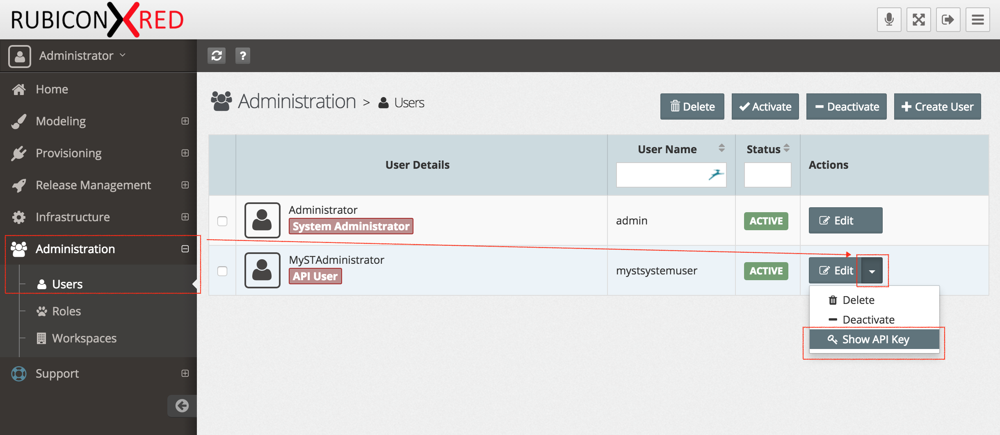

> **WARNING:** This is an advanced instruction for manipulating MyST using the REST APIs. You should not do this unless absolutely necessary and should take a backup of the database before performing any direct manipulations using the API. You have been warned.

MyST Studio is built on top of a set of REST APIs meaning any operations performed by the UI can also be automated using the REST APIs.

In this example, we are showing how to update a Platform Blueprint using the REST API. At a minimum you will require `curl` to be installed on your machine. To make JSON manipulation easier, it is also recommended to install `jq` which is downloadable from [here](https://stedolan.github.io/jq/download/).

## Retrieving your API key

In order to interact with API, you will first need to retrieve and/or regenerate an API key from MyST Studio. This can be performed as follows:
1. Login to MyST Studio with an administrator account
2. Click on "Administration" then select "Users"
3. Under the MySTAdministrator \(API User\) click on drop-down and select "Show API Key"

4. Copy the key, we will use this later in our MyST workspace. If you want, you can generate a new key at any time.


## Setting up your environment

The below `curl` examples will assume the following are set as environment variables
 * `MYST_TOKEN=<your api key>`
 * `MYST_HOST=<your MyST host>`

## Getting a list of available Blueprints

`curl -k -X GET -H "Authorization: Bearer $MYST_TOKEN"  "https://$MYST_HOST/api/v1/platform/blueprints"`

To pretty print the JSON result, you should consider piping that to `jq` as follows:

`curl -k -X GET -H "Authorization: Bearer $MYST_TOKEN"  "https://$MYST_HOST/api/v1/platform/blueprints" | jq`

## Getting the ID of a specific Platform Blueprint

The `id` of a given Blueprint can be discovered within the listing of Platform Blueprints at `.data.id`. For instance, in the snippet below the `id` of `SOA Blueprint` is `c2a9a9c6-4dd6-44b4-8b7a-54a14a235802`.

```
{
  "data": [
    {
      "id": "c2a9a9c6-4dd6-44b4-8b7a-54a14a235802",
      "name": "SOA Blueprint",
      ...
```      

If you want to programmatically find the id for `SOA Blueprint` you could execute the following with `curl` and `jq`

```
ID=$(curl -k -X GET -H "Authorization: Bearer $MYST_TOKEN"  "https://$MYST_HOST/api/v1/platform/blueprints" | jq --arg NAME "SOA Blueprint" -r ".data[] | select(.name == \$NAME) | .id")
```

Now you can execute `echo $ID` and it will output the Blueprint ID. For example:

`c2a9a9c6-4dd6-44b4-8b7a-54a14a235802`

## Download the source file for a given Platform Blueprint

In the previous step, we should how to get the identifier for a platform blueprint and set that to an environment variable called `ID`.

Now, we are going to download that source to a file called `blueprint.json` for `1.0.0` of our platform blueprint.

```
curl -k -X GET -H "Authorization: Bearer $MYST_TOKEN"  "https://$MYST_HOST/api/v1/platform/blueprints/$ID/versions/1.0.0?suppressComputed=true&dataFilters=*" > blueprint.json
```

**Note:** If you're blueprint is on a different version to 1.0.0, make sure you change that in your query. 

## Manipulate the local Platform Blueprint source file and update MyST

If you want to change the previously downloaded Blueprint you need to first extract the contents from the `data` element and create a new file.

For example,
```
{
  "data": {
    {
       "id": "c2a9a9c6-4dd6-44b4-8b7a-54a14a235802",
       "name": "SOA Blueprint",
       ...
```
should look like
```
{
    "id": "c2a9a9c6-4dd6-44b4-8b7a-54a14a235802",
    "name": "SOA Blueprint",
   ...
```

If you wanted to automatically update the Blueprint to conform to this, you could run the following in `jq` to create a `new-blueprint.json` file from `blueprint.json`
```
jq .data < blueprint.json > new-blueprint.json
```

Now that you have a `new-blueprint.json` which is in a format that can be pushed to MyST, you can update the contents as you see fit. Once you are happy with the change, you can push that to MyST as shown below.

```
curl -k -X PUT -H "Content-Type:application/json" -H "Authorization: Bearer $MYST_TOKEN"  -d @new-blueprint.json "https://$MYST_HOST/api/v1/platform/blueprints/$ID/versions/1.0.0"
```

Again, make sure the version matches the version you wish to change. In the above example it is set to `1.0.0`.

## Commit the Platform Blueprint

After you have saved your Platform Blueprint change to MyST Studio, it will still be in an uncommitted stage, you can either login to MyST Studio and commit the change using the web console or you can do it using the REST API. Below is an example commit request.

```
curl -k -X POST -H "Content-Type:application/json" -H "Authorization: Bearer $MYST_TOKEN"  "https://$MYST_HOST/api/v1/platform/blueprints/$ID/versions/1.0.0/commit"
```